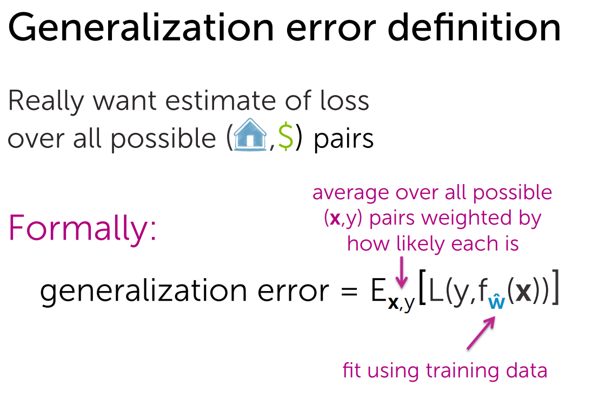

# Generalization Error
```
Generalization Error (Genelleştirme Hatası), bir makine öğrenimi modelinin eğitim verisi dışında yeni, görülmemiş veri üzerinde ne kadar iyi performans gösterdiğini ölçen bir metrik veya kavramdır. Başka bir deyişle, modelin genelleme yeteneğini ifade eder.
```


```
L(y,f(x)) => Hata fonksiyonu(örneğin, Mean Squared Err(MSE))
y => gerçek değer, f(x) => modelin tahmini

Eğitim verisindeki hata genellikle düşük olabilir, ancak genelleştirme hatası modeli eğitim verisi dışında test ederek ölçülür. İdeal bir modelin genelleştirme hatası, eğitim ve test verileri arasında küçük bir fark ile düşük olmalıdır.

Generalization error sapması 3 faktörle ilişkilidir: Bias, Varianca, Noise

```

# 1. Bias(Sapma)
`Nedir`
```
Bias, bir modelin basitleştirilmiş varsayımlar yaparak gerçek dünyayı temsil etme yeteneğindeki eksikliktir. Yüksek bias, modelin öğrenmekte zorlandığını ve yeterince esnek olmadığını gösterir. Bu genellikle modelin underfitting (yetersiz öğrenme) yapmasına neden olur.

Örnek:
    - Bir öğrencinin, "Türkiye'nin başkenti" sorusuna daima İstanbul demesi yüksek bias’a örnektir. Çünkü öğrenci, öğrenmesi gereken temel bilgiyi basit bir genellemeye indirgemiştir ve yanlış sonuç verir.

Makine Öğreniminde:
    - Bir doğrusal regresyon modeline, doğrusal olmayan bir ilişkiye sahip veri seti verirsek, model esnek olmadığı için veriye uyum sağlayamaz. Sonuçta yüksek bias oluşur.
```

# 2. Variance(Varyans)
`Nedir`
```
Variance, bir modelin veriye fazla uyum sağlama eğiliminde olmasıdır. Yani model, eğitim verisindeki en küçük detayları ve hataları öğrenir, ancak bu detaylar genelde gürültüden (noise) kaynaklanır. Bu durum, modelin overfitting (aşırı öğrenme) yapmasına yol açar.

Örnek:
    - Bir öğrencinin, "Türkiye'nin başkenti" sorusunu ezber yaparak sadece Ankara yazan kâğıtlara doğru cevap verip diğer tüm olasılıkları yanlış bilmesi yüksek varyanslı bir öğrenme örneğidir. Öğrenci, genel bilgiyi değil, sadece örnekleri ezberlemiştir.

Makine Öğreniminde:
    - Bir karar ağacı modeli, her bir eğitim örneğini mükemmel bir şekilde sınıflandırmaya çalışırsa, varyansı artar ve test verisi üzerinde kötü performans gösterir.
```

# 3. Noise(Gürültü)

`Nedir`

```
Noise, verideki anlamlı olmayan ve rastgele değişkenliklerdir. Gürültü, modellerin öğrenmemesi gereken ancak bazen öğrendiği hatalardır. Gürültü veri kalitesinin düşük olduğu durumlarda artar.

Örnek:
    - Bir öğretmenin, "Türkiye'nin başkenti nedir?" sorusuna yanlışlıkla "Kayseri" demesi ve öğrencinin bunu doğru olarak öğrenmesi gürültüye bir örnektir. Öğrenci doğru bilgi yerine hatalı bilgiyi öğrenmiştir.

Makine Öğreniminde:
    - Etiketlerin yanlış girildiği veya verilerin eksik olduğu bir veri setinde, gürültü yüksek olur. Gürültüyü öğrenen bir model, hem eğitim hem de test verisinde kötü performans gösterebilir.
```

# BIAS-VARIANCE İLİŞKİSİ
```
Bir modelin başarısı, bias ve varyans arasında dengeli bir trade-off (takas) yapmasına bağlıdır:

Yüksek Bias, Düşük Varyans: Model basit olduğunda (ör. doğrusal regresyon), genelleştirmesi zayıf olur ve hatalı tahminler yapar.

Yüksek Varyans, Düşük Bias: Model karmaşık olduğunda (ör. çok derin bir karar ağacı), eğitim verisine aşırı uyar ve test verisinde başarısız olur.

Grafikle Anlatım:
- Underfitting (Yüksek Bias): Tahmin eğrisi veriye uyum sağlayamaz (çok basit).
- Overfitting (Yüksek Varyans): Tahmin eğrisi veriye aşırı uyum sağlar (çok karmaşık).
- İdeal Durum: Model, hem bias hem de varyansın minimum olduğu bir denge noktası yakalar.
```

## Average-Prediction-Error


# Expected Prediction Error

```
Expected Prediction Error (EPE), bir makine öğrenimi modelinin, eğitimde görmediği yeni veriler üzerinde yaptığı tahminlerdeki ortalama hatayı ifade eder. Bu kavram, modelin genelleme yeteneğini değerlendirirken kullanılan bir metrik olarak düşünülebilir.
```


